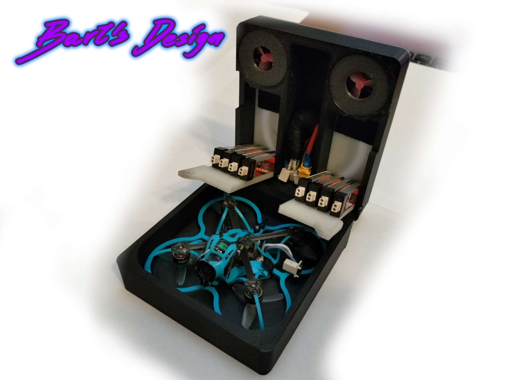

# Mantis repo

**"Mantis" is 1,2" printable freestyle/racing 1S tinywhoop**

# 3D printing
- **frame**
: PA12
- **canopy**
: PA12
- **FC cover**
: PA12
- **motor base**
: PC-CF / PETG-CF
- **tail support**
: TPU
- **sleeve**
: any

# BOM

## mechanical
- **motor base**
: printed mantis motor base or NEWBEEDRONE Cockroach V3 Carbon Fiber Motor Base - optional part, but recommended
- **frame**
: printed mantis frame or NEWBEEDRONE Cockroach V3 65mm Ultra Light Frame PC/PP- order at least 1 spare
- **propellers**
: HQ 31mm Ultralight 3-Blade Propellers (1.0mm Shaft)
- **PA screws** (only for printed frame)
: 4x PA M2x15 screws
- **PA nuts** (only for printed frame)

## electronic
- **FC**
: BETAFPV Matrix 1S Brushless Flight Controller (5IN1)
- **motors**
: HAPPYMODEL SE0702 KV28000- make sure to order at least 1 spare
- **camera**
: CADDXFPV ant lite / Vetafpv C03
- **batteries**
: BETAFPV LAVA 1S 260mAh 3.8V HV 80C BT2.0 (x5) - at least one set
- **charger**
: BETAFPV 6 Ports 1S Battery Charger (optionally with adapter)
- **cable**
: USB-C cable for communication

## control
- **controller**
: Jumper Bumblebee, or any other with ELRS and edgeTX
- **batteries**
: 2x 18650 any branded Li-Ion cells for controller supply
- **goggle**
: BETAFPV VR03 or any other analog goggles
- **memory**
: 32G SDcard if you want to record your flights

## software
- **FC config**
: betaflight configurator
- **radio config**
: ExpressLRS Configurator