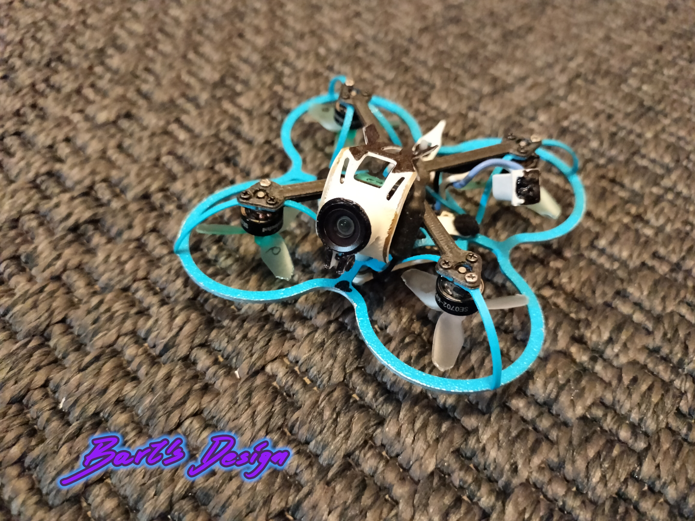

# Mantis repo

**"Mantis" is 1,2" printable freestyle/racing 1S tinywhoop**

# 3D printing
- **frame**
: PA12
- **ducts convertible**
: PC
- **canopy**
: PA12 / PP
- **FC cover**
: PA12
- **motor base**
: PC-CF / PETG-CF
- **tail support**
: TPU
- **sleeve**(optional)
: any

# BOM

## mechanical
- **motor base**
: printed mantis motor base or NEWBEEDRONE Cockroach V3 Carbon Fiber Motor Base
- **frame**
: printed mantis frame or NEWBEEDRONE Cockroach V3 65mm Ultra Light Frame PC/PP- order at least 1 spare
- **propellers**
: HQ 31mm Ultralight 3-Blade Propellers (1.0mm Shaft) or NBD Azi 3 blade 31mm
- **PA screws** (only for printed frame)
: 4x PA M2x15 screws
- **PA nuts** (only for printed frame)
: 4x PA M2 nuts

## electronic
- **FC**
: BETAFPV Matrix 1S Brushless Flight Controller (5IN1 for SD or 4IN1 for HD)
- **motors**
: HAPPYMODEL SE0702 KV28000
- **camera**
: CADDXFPV ant lite / BETAFPV C03(SD) or P1 air unit(HD)
> for SD: order also CADDXFPV Camera Accessories OSD Menu Board for ant lite camera, and switch video mode to PAL
- **batteries**
: BETAFPV LAVA 1S 260mAh 3.8V HV 80C BT2.0 (x5) - at least one set
- **charger**
: BETAFPV 6 Ports 1S Battery Charger (optionally with adapter)
- **cable**
: USB-C cable for communication
- **VTX**
: Foxeer reaper nano(only for SD 4in1)

## control
- **controller**
: Jumper Bumblebee, or any other with ELRS and edgeTX
- **batteries**
: 2x 18650 any branded Li-Ion cells for controller supply
- **goggle**
: BETAFPV VR03 or any other analog goggles for SD
- **memory**
: 32G SDcard if you want to record your flights

## software
- **FC config**
: betaflight configurator
- **radio config**
: ExpressLRS Configurator

## firmware
If you are building remotely:
> choose analog OSD Protocol and type **OSD_HD** in custom defines, to build firmware with both- digital and analog OSD