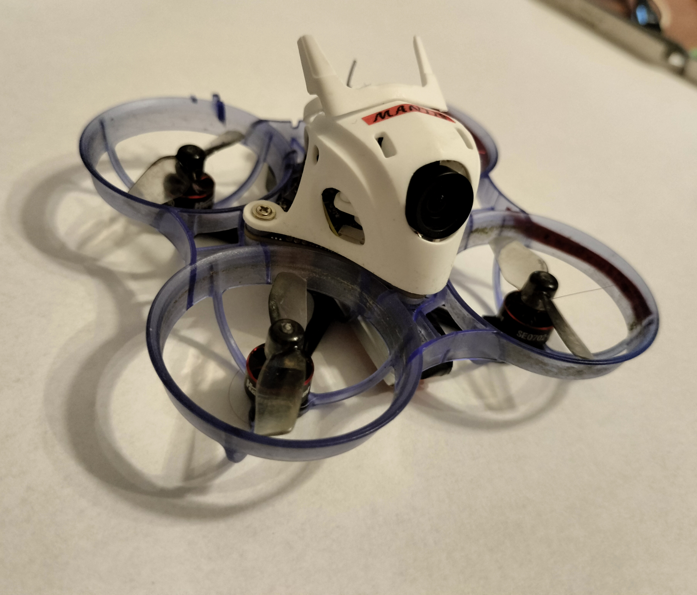

# Mantis repo

**"Mantis" is 1,2" freestyle/racing tinywhoop type drone with 1S battery**

# BOM

## mechanical
- **motor base**
: NEWBEEDRONE Cockroach V3 Carbon Fiber Motor Base - optional part, but recommended
- **frame**
: NEWBEEDRONE Cockroach V3 65mm Ultra Light Frame PC/PP- order at least 1 spare
- **propellers**
: HQ Micro Whoop Prop 31MMX2 1mm- order at least 3-4 sets

## electronic
- **FC**
: BETAFPV Matrix 1S Brushless Flight Controller (5IN1)
- **motors**
: HAPPYMODEL SE0702 KV28000- make sure to order at least 1 spare
- **camera**
: BETAFPV C03 FPV Micro Camera
- **batteries**
: BETAFPV LAVA 1S 260mAh 3.8V HV 80C BT2.0 (x5) - at least one set :)
- **charger**
: BETAFPV 6 Ports 1S Battery Charger (optionally with adapter)
- **cable**
: USB-C cable for communication

## control
- **controller**
: RADIOMASTER Pocket(Crush) ELRS LBT, or any other with ELRS and edgeTX
- **batteries**
: 2x 18650 any branded Li-Ion cells for controller supply
- **goggle**
: BETAFPV VR03 or any other analog goggles
- **memory**
: 32G SDcard if you want to record your flights
- **power bank**
: any 10-20 Ah PD power bank due to the small battery of goggles

## software
- **FC config**
: betaflight configurator
- **radio config**
: ExpressLRS Configurator