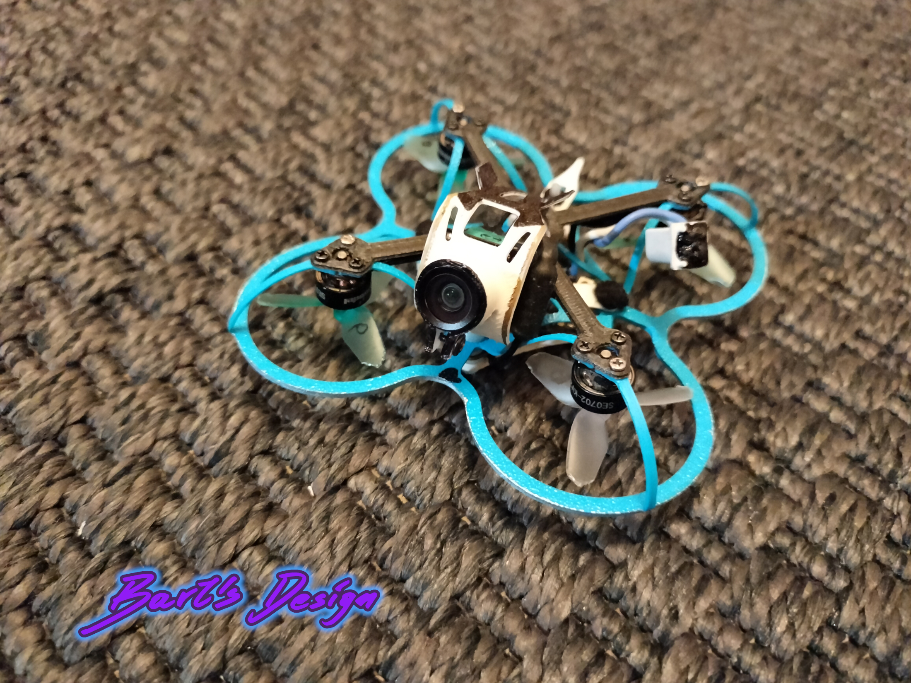

# Mantis repo

**"Mantis" is 1,2" printable freestyle/racing 1S tinywhoop**

# 3D printing
- **frame**
: PA12
- **ducts convertible**
: PC/PETG
- **canopy**
: PA12/TPU
- **FC cover**
: PA12
- **base**
: PC-CF/PETG-CF
- **tail support**
: TPU

# mechanical
- **base**
: printed basebase
- **frame**
: printed mantis frame
- **propellers**
: HQ 31mm Ultralight 3-Blade Propellers (1.0mm Shaft) or NBD Azi 3 blade 31mm
- **PA screws**
: 4x PA M2x15 screws
- **PA nuts**
: 4x PA M2 nuts

# electronic
- **FC**
: BETAFPV Matrix 1S Brushless Flight Controller 4IN1/3IN1
- **motors 1.2"**
: HAPPYMODEL SE0702 KV28000
- **motors 1.6"**
: BETAFPV 0802 Brushless Motors (2026) Racing
- **camera**
: CADDXFPV ant lite / BETAFPV C03(SD) or P1 air unit(HD)
> for SD: order also CADDXFPV Camera Accessories OSD Menu Board for ant lite camera, and switch video mode to PAL
- **batteries 1.2"**
: BETAFPV LAVA II 1S 280mAh 3.8V HV
- **batteries 1.6"**
: BETAFPV LAVA II 1S 480mAh 3.8V HV
- **charger**
: BETAFPV 6 Ports 1S Battery Charger (optionally with adapter)
- **cable**
: USB-C cable for communication
- **VTX**
: Foxeer reaper nano(only for SD 4in1)

# control
- **controller**
: Jumper Bumblebee, or any other with ELRS and edgeTX
- **batteries**
: 2x 18650 any branded Li-Ion cells for controller supply
- **goggle**
: BETAFPV VR03 or any other analog goggles for SD
- **memory**
: 32G SDcard if you want to record your flights

# software
- **FC config**
: betaflight configurator
- **radio config**
: ExpressLRS Configurator

# firmware
If you are building remotely:
> choose analog OSD Protocol and type **OSD_HD** in custom defines, to build firmware with both- digital and analog OSD 
> In other options add **Magnetometers**, **Position Hold** and **Altitude Hold**

## notice
This repository includes third-party firmware binaries used by this FPV drone.

### Betaflight

Version: `2025.12.2`, `2025.12.4`

Included firmware:

- `betaflight_2025.12.2_STM32G474_BETAFPVG473_ccb6e7f3.hex`
- `betaflight_2025.12.2_STM32G474_BETAFPVG473_V2_aa260427.hex`
- `betaflight_2025.12.4_STM32G474_BETAFPVG473_V2_532cac95.hex`

These firmware files were generated using the official Betaflight Cloud
Build service from Betaflight `2025.12.2` or `2025.12.4`

Flight controller targets:

- `BETAFPVG473`
- `BETAFPVG473_V2`

Additional build options used for this project:

- Analog OSD
- `OSD_HD`
- Magnetometers (`MAG`)
- Position Hold (`POSITION_HOLD`)
- Altitude Hold (`ALTITUDE_HOLD`)

No modifications were made to the Betaflight source code by this repository.
The options listed above are compile-time options supported by the official
Betaflight build system.

Corresponding source:

https://github.com/betaflight/betaflight,  tag `2025.12.2` / `2025.12.4`

Betaflight is distributed under the GNU General Public License version 3.
A copy of the GNU GPL v3 is included in this repository as `LICENSE.txt`.

### Bluejay

Version: `v0.19.2`

Included firmware:

- `A_X_5_96_v0.19.2.hex`

This is an unmodified Bluejay firmware binary from the upstream
`v0.19.2` release.

Corresponding source:

Bluejay repository, tag `v0.19.2`.

Bluejay is distributed under the GNU General Public License version 3.
A copy of the GNU GPL v3 is included in this repository as `GPL-3.0.txt`.

### Copyright and attribution

Betaflight and Bluejay are independent open-source projects.
Copyright remains with their respective authors and contributors.

This repository does not claim ownership of Betaflight or Bluejay and is
not affiliated with or endorsed by either project.

[Betaflight](https://github.com/betaflight/betaflight/tree/2025.12.2)

[Bluejay](https://github.com/bird-sanctuary/bluejay/tree/v0.19.2)
